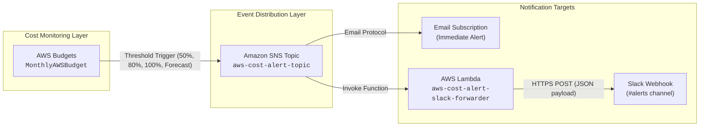

# AWS Cost Alert Setup


A Python/Boto3 automation suite that provisions AWS Budget alerts with **email (SNS)** and **optional Slack** notifications at 50%, 80%, 100%, and forecasted-100% spend thresholds — complete with an interactive dashboard and automated cloud deployment.

**Project code:** `WTC-JJNPY2UD`

---

## Live Endpoints

| Platform | Endpoint | Status | Description |
| :--- | :--- | :--- | :--- |
| **AWS CloudFront (Global HTTPS CDN)** | [https://dqn6y9v4r51ro.cloudfront.net](https://dqn6y9v4r51ro.cloudfront.net) | `Live` (HTTPS 200 OK) | Fast, global SSL/TLS CDN for interactive cost alerts dashboard |
| **GitHub Pages (Live Dashboard)** | [https://sthabisoxakaza52.github.io/aws-cost-alerts/](https://sthabisoxakaza52.github.io/aws-cost-alerts/) | `Live` (HTTP 200 OK) | Interactive web monitoring dashboard |

---

## What it creates

| Resource | Name | Description |
|---|---|---|
| **SNS Topic** | `aws-cost-alert-topic` | Receives all budget alert events |
| **Email subscription** | _(your email)_ | Requires one-time confirmation click |
| **Lambda function** | `aws-cost-alert-slack-forwarder` | Forwards SNS → Slack _(optional)_ |
| **IAM Role** | `aws-cost-alert-lambda-role` | Minimal execution role for Lambda |
| **AWS Budget** | `MonthlyAWSBudget` | Monthly cost budget with 4 alert thresholds |

---

## Project Structure

```text
aws-cost-alerts/
├── .github/
│   ├── workflows/
│   │   ├── ci.yml                 # Multi-version Python CI pipeline (3.9 - 3.12)
│   │   └── deploy.yml             # GitHub Pages automated publishing
│   └── copilot-instructions.md    # Repository coding invariants
├── cost_alerts/                   # Core Python application package
│   ├── __init__.py                # Package initialization
│   ├── aws_clients.py             # Boto3 session & STS credentials
│   ├── budget.py                  # AWS Budgets management (create/update)
│   ├── cli.py                     # Command-line interface & argument parsing
│   ├── config.py                  # Configuration defaults & thresholds
│   ├── dashboard.html             # Interactive cost alerts monitoring console
│   ├── dashboard.py               # Dashboard launcher, S3 & CloudFront deployers
│   ├── lambda_fn.py               # Slack Lambda forwarder & IAM role management
│   ├── notifications.py           # Spend threshold definitions (50%, 80%, 100%)
│   ├── sns.py                     # SNS topic creation & email subscriptions
│   └── teardown.py                # Automated AWS resource cleanup & teardown
├── infra/                         # CloudFormation templates & cloud assets
│   └── cloudfront.yaml            # CloudFront HTTPS CDN + S3 Origin Access Control
├── scripts/                       # Operational & deployment automation
│   └── deploy_cloudfront.sh       # 1-command deployment script for AWS CloudShell
├── docs/                          # Public web documentation & GitHub Pages host
│   └── index.html                 # Live dashboard mirror for GitHub Pages
├── tests/                         # Modular domain-driven test suite
│   ├── __init__.py
│   ├── conftest.py                # Shared fixtures & mock session helpers
│   ├── test_budget.py             # AWS Budgets tests (11 tests)
│   ├── test_cli.py                # CLI argument & dry-run tests (20 tests)
│   ├── test_dashboard.py          # Dashboard & deployment tests (7 tests)
│   ├── test_lambda_fn.py          # Slack forwarder Lambda tests (11 tests)
│   ├── test_notifications.py      # Threshold calculation tests (8 tests)
│   ├── test_readme.py             # Project code & cleanup invariant tests (1 test)
│   ├── test_sns.py                # SNS topic & email tests (5 tests)
│   └── test_teardown.py           # Teardown logic tests (3 tests)
├── .gitignore                     # Comprehensive Git ignores
├── pyproject.toml                 # Standard Python build configuration
├── requirements.txt               # Python package dependencies
├── setup_cost_alerts.py           # Backward-compatible entry point
└── README.md                      # Project documentation & live endpoints
```

---

## Cloud architecture overview

This project demonstrates a lightweight AWS monitoring workflow built around budget automation and event-driven notifications:



### Visual Architecture Flow

```text
  ┌──────────────────────┐
  │     AWS Budgets      │ (Evaluates monthly spend against limit)
  │  (MonthlyAWSBudget)  │
  └──────────┬───────────┘
             │ Alert Event (50%, 80%, 100% Actual / Forecasted)
             ▼
  ┌──────────────────────┐
  │   Amazon SNS Topic   │ (Fan-out notification hub)
  │(aws-cost-alert-topic)│
  └─────┬──────────┬─────┘
        │          │
        │ Email    │ Lambda Invoke
        ▼          ▼
  ┌───────────┐  ┌─────────────────────────────────┐
  │ Recipient │  │       AWS Lambda Forwarder      │
  │   Email   │  │(aws-cost-alert-slack-forwarder) │
  └───────────┘  └────────────────┬────────────────┘
                                  │ HTTPS Webhook POST
                                  ▼
                         ┌─────────────────┐
                         │  Slack Channel  │
                         └─────────────────┘
```

- **AWS Budgets** tracks monthly spend thresholds and raises alarms when usage crosses configured limits.
- **Amazon SNS** receives the budget events and distributes them to an email subscription.
- **AWS Lambda** forwards SNS messages to Slack through an incoming webhook for real-time team alerts.
- **IAM** provides the minimal permissions required for the Lambda execution role and AWS resource provisioning.

This pattern is useful for cloud cost governance because it combines alerting, automation, and operational visibility in a simple, low-cost setup.

---

## How the cloud workflow works

1. The CLI validates the budget, email, region, and optional Slack webhook before making AWS calls.
2. AWS Budgets evaluates monthly spend against the configured actual and forecasted thresholds.
3. When a threshold is crossed, AWS Budgets publishes an alert to the SNS topic.
4. SNS sends the alert to the confirmed email subscription and, when enabled, invokes the Lambda forwarder.
5. Lambda reads the webhook from its environment configuration and posts the notification to Slack.

The setup is designed to be repeatable: an existing budget is updated instead of being deleted and recreated, and the `--dry-run` option provides a safe preview before provisioning resources.

### Production considerations

- Use an IAM role or least-privilege deployment identity instead of long-lived access keys where possible.
- Keep the Slack webhook out of source control and rotate it if it is exposed.
- Confirm the SNS email subscription before relying on alerts.
- Review AWS Budgets and Lambda costs periodically, even though this project is intended to be lightweight.

---

## Prerequisites

### 1 — Python 3.8+

| OS | Check / Install |
|---|---|
| **Windows** | [python.org/downloads](https://www.python.org/downloads/) — tick **"Add Python to PATH"** during install |
| **macOS** | `python3 --version` — install via [python.org](https://www.python.org/downloads/) or `brew install python` |
| **Linux** | `python3 --version` — install via `sudo apt install python3` / `sudo dnf install python3` |

### 2 — Install dependencies

```bash
pip install boto3
```

> On some systems use `pip3` instead of `pip`.

### 3 — AWS credentials configured

Run `aws configure` (requires the [AWS CLI](https://docs.aws.amazon.com/cli/latest/userguide/install-cliv2.html)), or set environment variables:

```bash
# macOS / Linux / Git Bash
export AWS_ACCESS_KEY_ID=AKIA...
export AWS_SECRET_ACCESS_KEY=...
export AWS_DEFAULT_REGION=us-east-1
```

```powershell
# Windows PowerShell
$env:AWS_ACCESS_KEY_ID     = "AKIA..."
$env:AWS_SECRET_ACCESS_KEY = "..."
$env:AWS_DEFAULT_REGION    = "us-east-1"
```

```cmd
REM Windows Command Prompt (CMD)
set AWS_ACCESS_KEY_ID=AKIA...
set AWS_SECRET_ACCESS_KEY=...
set AWS_DEFAULT_REGION=us-east-1
```

The IAM user/role needs these permissions:
- `budgets:CreateBudget`, `budgets:UpdateBudget`
- `sns:CreateTopic`, `sns:Subscribe`
- `lambda:CreateFunction`, `lambda:GetFunction`, `lambda:UpdateFunctionCode`, `lambda:UpdateFunctionConfiguration`, `lambda:AddPermission`
- `iam:CreateRole`, `iam:AttachRolePolicy`, `iam:GetRole`
- `sts:GetCallerIdentity`

---

## Usage

### Windows — PowerShell

Use a **backtick (`` ` ``)** for line continuation:

```powershell
python setup_cost_alerts.py `
  --budget 150 `
  --email alerts@mycompany.com `
  --region us-east-1 `
  --slack-webhook https://hooks.slack.com/services/T00/B00/xxx
```

Or all on one line:

```powershell
python setup_cost_alerts.py --budget 150 --email alerts@mycompany.com --slack-webhook https://hooks.slack.com/services/T00/B00/xxx
```

### Windows — Command Prompt (CMD)

Use a **caret (`^`)** for line continuation:

```cmd
python setup_cost_alerts.py ^
  --budget 150 ^
  --email alerts@mycompany.com ^
  --region us-east-1 ^
  --slack-webhook https://hooks.slack.com/services/T00/B00/xxx
```

### macOS / Linux / Git Bash / WSL

Use a **backslash (`\`)** for line continuation:

```bash
python3 setup_cost_alerts.py \
  --budget 150 \
  --email alerts@mycompany.com \
  --region us-east-1 \
  --slack-webhook https://hooks.slack.com/services/T00/B00/xxx
```

---

## All options

| Flag | Required | Description |
|---|---|---|
| `--budget` | ✅ | Monthly budget limit in USD (e.g. `150`) |
| `--email` | ✅ | Email address to receive SNS alerts |
| `--slack-webhook` | ❌ | Slack incoming webhook URL — omit to skip Slack setup |
| `--budget-name` | ❌ | Custom name for the budget (default: `MonthlyAWSBudget`) |
| `--profile` | ❌ | AWS CLI named profile to use |
| `--region` | ❌ | AWS region: `us-east-1`, `us-west-1`, `us-west-2`, `eu-north-1` (default: `us-east-1`) |
| `--dry-run` | ❌ | Preview what would be created or destroyed without making any changes |
| `--destroy` | ❌ | Automated teardown of provisioned AWS resources (Budget, SNS, Lambda, IAM) |
| `--dashboard` | ❌ | Launch or preview interactive AWS Cost Alerts dashboard |
| `--port` | ❌ | Port for dashboard local server (default: `8000`) |
| `--deploy-dashboard` | ❌ | Deploy interactive dashboard to Amazon S3 static website bucket |
| `--deploy-cloudfront` | ❌ | Deploy interactive dashboard to AWS CloudFront CDN with S3 Origin Access Control |

---

## Example workflow

**Step 1 — Dry run first (safe preview)**

```bash
# macOS / Linux
python3 setup_cost_alerts.py \
  --budget 150 \
  --email alerts@mycompany.com \
  --slack-webhook https://hooks.slack.com/services/T00/B00/xxx \
  --dry-run
```

```powershell
# Windows PowerShell
python setup_cost_alerts.py `
  --budget 150 `
  --email alerts@mycompany.com `
  --slack-webhook https://hooks.slack.com/services/T00/B00/xxx `
  --dry-run
```

**Step 2 — Apply for real (remove `--dry-run`)**

```bash
python3 setup_cost_alerts.py \
  --budget 150 \
  --email alerts@mycompany.com \
  --slack-webhook https://hooks.slack.com/services/T00/B00/xxx
```

**Email-only setup (no Slack)**

```bash
python3 setup_cost_alerts.py --budget 150 --email alerts@mycompany.com
```

**Step 3 — Automated teardown / cleanup (when done)**

```bash
# Preview resources to be deleted without modifying AWS
python3 setup_cost_alerts.py --destroy --dry-run

# Run automated teardown
python3 setup_cost_alerts.py --destroy
```

```powershell
# Windows PowerShell
python setup_cost_alerts.py --destroy --dry-run
python setup_cost_alerts.py --destroy
```

**Step 4 — View interactive dashboard**

```bash
# Preview dashboard file path
python3 setup_cost_alerts.py --dashboard --dry-run

# Open dashboard in browser
python3 setup_cost_alerts.py --dashboard
```

```powershell
# Windows PowerShell
python setup_cost_alerts.py --dashboard --dry-run
python setup_cost_alerts.py --dashboard
```

**Step 5 — Deploy to AWS CloudFront CDN (1-command deployment)**

Using the automated CloudShell script:
```bash
# In AWS CloudShell
./deploy_cloudfront.sh
```

Or using the Python CLI:
```bash
python3 setup_cost_alerts.py --deploy-cloudfront --region eu-north-1
```

Live distribution endpoint: [https://dqn6y9v4r51ro.cloudfront.net](https://dqn6y9v4r51ro.cloudfront.net)

---

## Alert thresholds

| Threshold | Type | Triggered when… |
|---|---|---|
| 50% | Actual spend | You've used half your budget |
| 80% | Actual spend | Approaching the budget limit |
| 100% | Actual spend | Budget has been exceeded |
| 100% | Forecasted | AWS predicts you'll exceed budget by month-end |

---

## After running

1. **Confirm your email** — AWS SNS sends a confirmation email immediately; click the link to activate alerts.
2. **Test Slack** — Publish a test message to the SNS topic from the AWS Console → SNS → Topics.
3. **View the budget** — AWS Console → Billing & Cost Management → Budgets.

---

## Getting a Slack Webhook URL

1. Go to [api.slack.com/apps](https://api.slack.com/apps) → **Create New App** → **From scratch**
2. Under **Features**, choose **Incoming Webhooks** → toggle **On**
3. Click **Add New Webhook to Workspace** → pick a channel → **Allow**
4. Copy the generated webhook URL and pass it as `--slack-webhook`

---

## Troubleshooting

| Error | Fix |
|---|---|
| `command not found: python` | Use `python3` instead, or ensure Python is on your PATH |
| `ModuleNotFoundError: boto3` | Run `pip install boto3` (or `pip3 install boto3`) |
| `ParserError: Missing expression after unary operator '--'` | You're in PowerShell — use backtick `` ` `` for line continuation, not `\` |
| `NoCredentialsError` | Run `aws configure` or set `AWS_ACCESS_KEY_ID` / `AWS_SECRET_ACCESS_KEY` |
| `AccessDenied` | Ensure your IAM user has all required permissions listed above |
| `SubscriptionLimitExceeded` | Delete old unused SNS subscriptions in the AWS Console |

---

## Uninstall / Cleanup

To remove all created resources:

1. **Budget** — AWS Console → Billing → Budgets → Delete `MonthlyAWSBudget`
2. **SNS Topic** — AWS Console → SNS → Topics → Delete `aws-cost-alert-topic`
3. **Lambda** — AWS Console → Lambda → Delete `aws-cost-alert-slack-forwarder`
4. **IAM Role** — AWS Console → IAM → Roles → Delete `aws-cost-alert-lambda-role`
